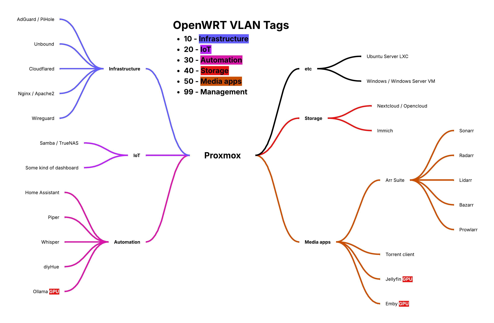
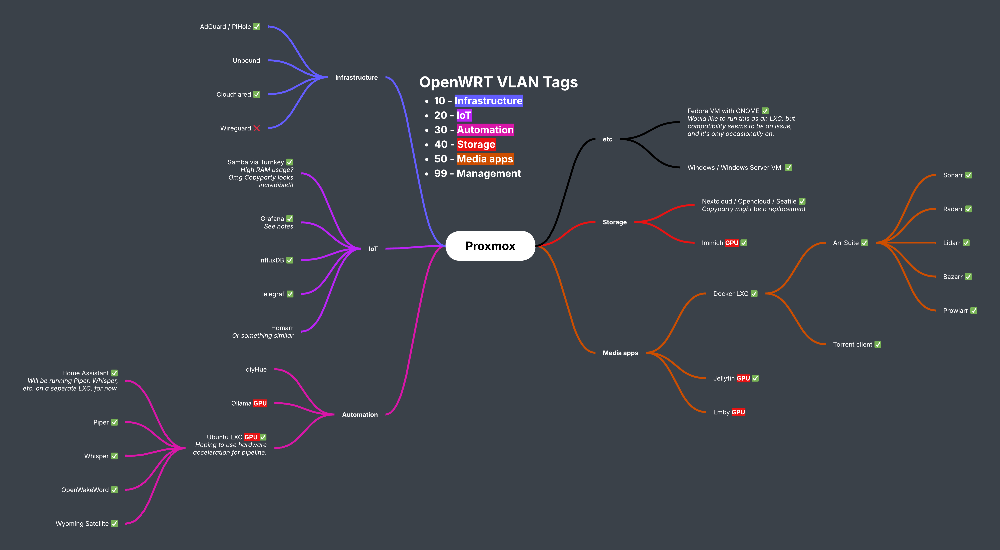
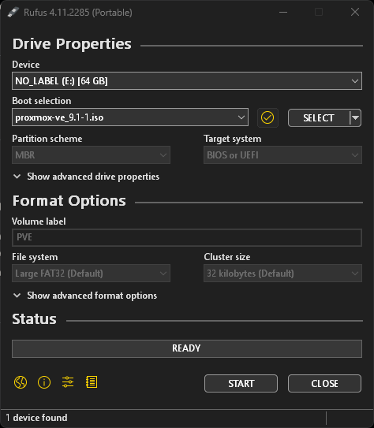

# Getting started

So, you’ve decided you want to set up a Proxmox homelab, awesome! But, where do you even start? What’s step one? My goal with this page is to get you prepared for that almighty moment where we download that Proxmox ISO and burn it onto a disc (just kidding, just wanted to flex that I’m old).

## What hardware do I need?

Ah yes, the age-old question. When I began my journey into homelabbing, I spent way too long overthinking this. The blanket answer you’ll usually find is “whatever you have lying around”, though it’s not always as simple as that (even if I did eventually just use whatever I had lying around).

What helped me answer this question was to actually sit down, write down everything I wanted to do with my homelab, and then start asking myself, “What did I need to accomplish these goals?” I wanted quite a lot. A home media server (with GPU passthrough), a NAS, a local LLM (that GPU passthrough is popping up again), my own local cloud storage solution, and the flexibility to add and upgrade in the future if the scope of my project were to increase. Fundamentally, the most important thing for me was scalability. I had been eyeing up some upgrades for my PC, so I ended up doing those upgrades, then using what I had taken out to build a new PC (plus some cheap extra parts sourced online).

If your scope is smaller, you absolutely could get away with one of those Intel mini PC’s, they’re small, powerful, and (I hear) fantastic for media encoding/decoding. I’ve even seen some people on Reddit running Proxmox on old Android phones for a neat portable music server!

TL;DR - Identify what you need from your homelab and then find the hardware to meet those needs.

## Identifying what you want to achieve

If you’re completely new at this, it can be a bit daunting to identify the exact services you want to use. You might have a very general idea of “I want a media server”, but have no idea what you even do to achieve that. Now, you could always ask ChatGPT (and if you do decide to do this, please please please verify anything it tells you using external sources), but for my personally, I think the best way to go about this is to jump onto YouTube, search “what’s on my home server” and you’ll find a bunch of weirdos (like myself hehe) who are super excited about what they’re running and very happy to explain why.

Orrrrrrr you could just use the services I’ve used, after all, that’s why I’ve made this guide.

Next, I’d recommend you start categorizing the services you want to use. This isn’t essential, well, I guess none of this is *really* essential, but in doing this, it’s going to make it easier for you to keep yourself and your work organized. Plus, it helps me feel less overwhelmed by everything I need to do!

I’m a very visual person, so for this I created a mind map. I’m going to share the mind map I created right at the beginning of my journey.

So, after I had completed the previous steps, this is what I had: a nicely laid out and colour-coordinated visualisation of my homelab to be! A few things you might notice is that anything that requires GPU passthrough is very clearly labelled (Immich needed it too, but I forgot to add that). This also allowed me to very easily move things about, add or remove things, and add a nice little green check mark when I had finished setting something up.

Here’s what it looked like towards the end of my journey of setting up my homelab (though, let’s not kid ourselves, we’re never *truly* finished).

As you can see, I’ve moved things around, added a new category, fixed that issue with the GPU labelling for Immich, and most importantly… Lots of green check marks (I also went to the dark side)! I’ve also added notes here and there to help me keep track of my thoughts and things I need to do.

## Setting up your installer

The time has come! Head over to the Proxmox website and go to the downloads page. I just grabbed the latest version available, however, others might recommend you download an older, more mature version for stability. There’s no right or wrong here, however, for this tutorial, I used version 9.0.10. If you go with a different version, just keep in mind that some things might be a little bit different.

If you’re old enough (and cool enough) like me to still have a disc drive, you can burn the ISO to disc, but outside of the coolness factor, I wouldn’t recommend this. Use a reliable USB stick.

I’d recommend you use Rufus for creating your USB installer. Insert your USB stick, and select the Proxmox ISO you just downloaded. Make doubly sure you’ve got the correct device selected at the top, then click “START”!

## Final thoughts

Whilst it might be tempting to just jump straight to downloading the ISO and installing Proxmox without a plan, in the long run this little bit of work pays of big time, even if the pay off is just being a little bit more focused and organized.
