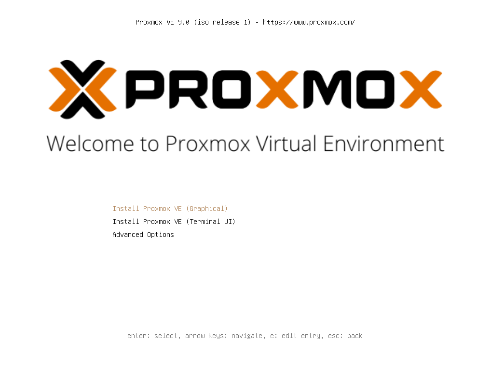
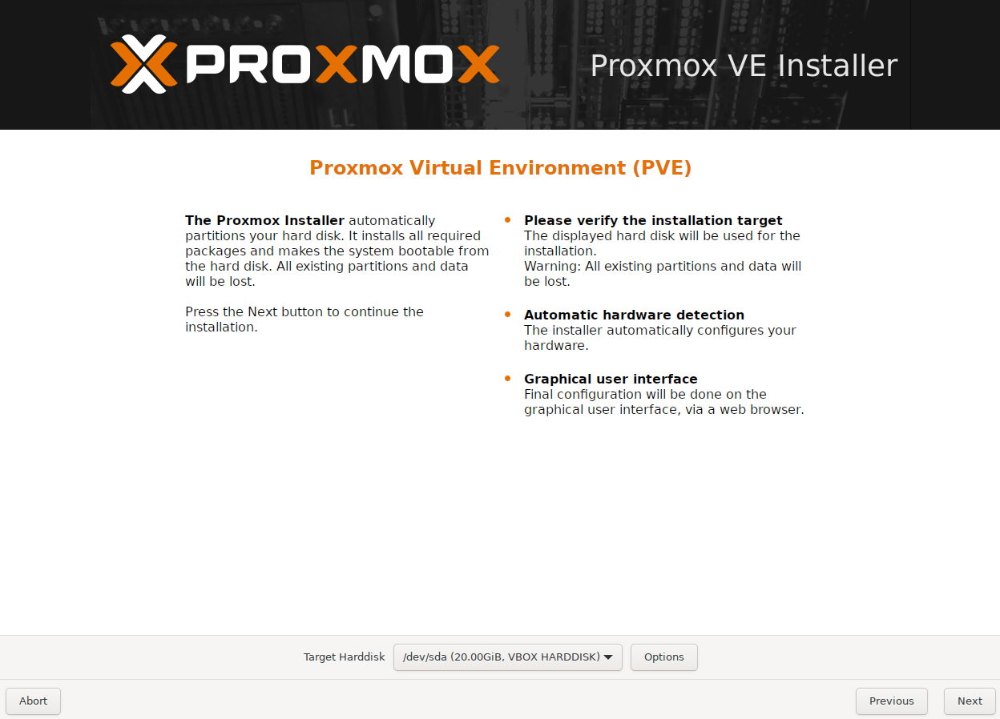
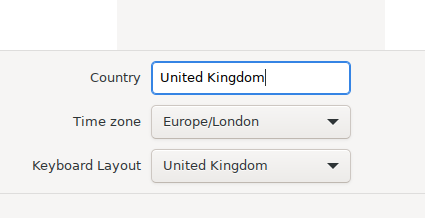
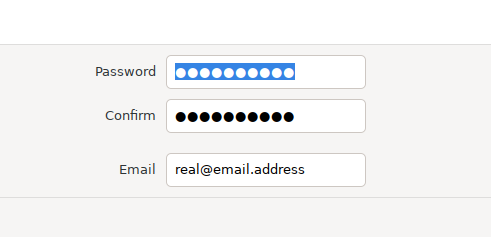
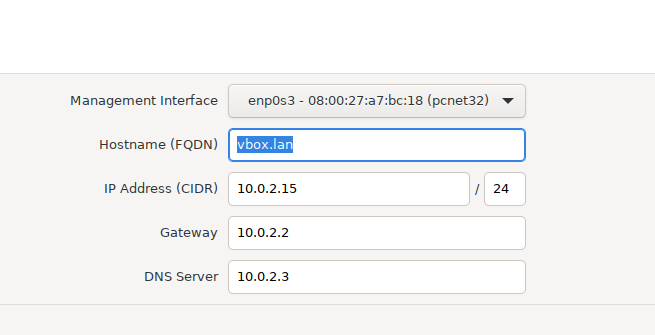
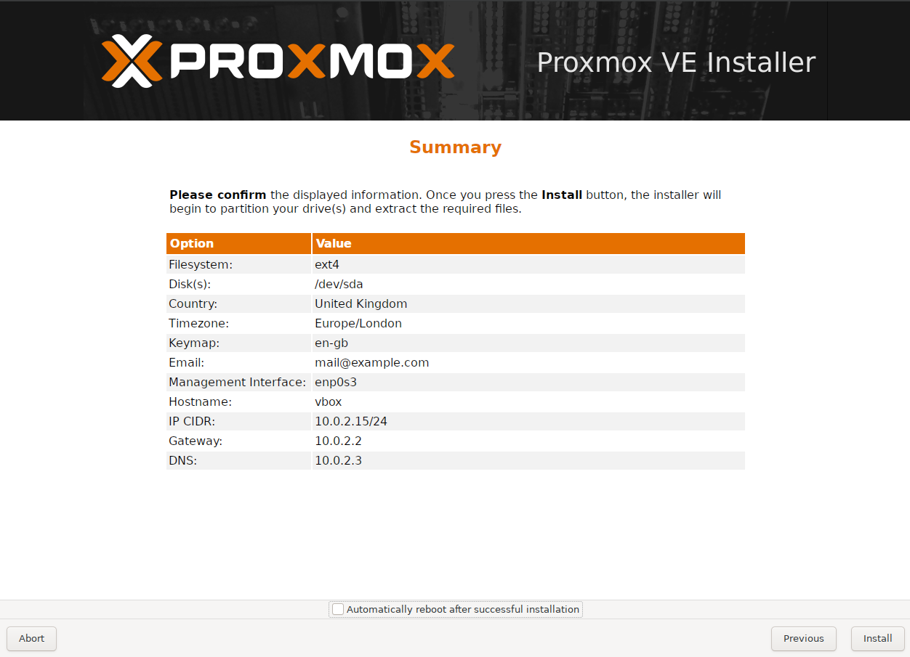
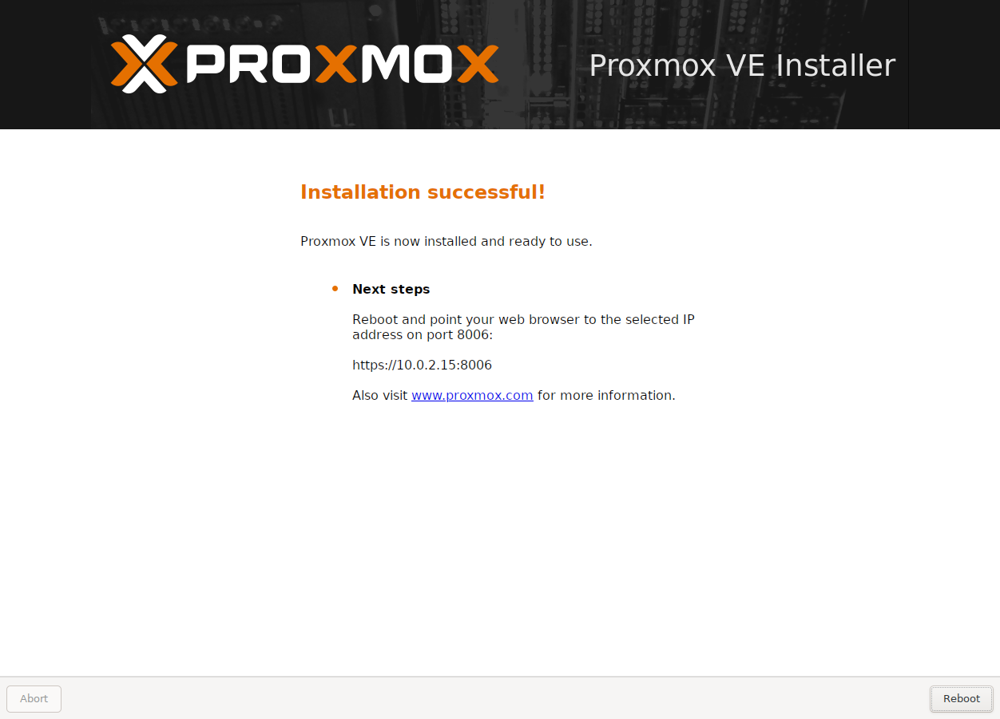

# Initial Setup

## Prerequisites

All you're going to need for this is:

 - [Your hardware](../infrastructure/installation_and_setup.md#what-hardware-do-i-need)
 - [Installation media](../infrastructure/installation_and_setup.md#setting-up-your-installer)
 - Monitor
 - Mouse and keyboard
 - Wired network connection
 - And, if you're anything like me, **a big cup of coffee**

*Screenshots for the installation process were taken from a VM, all other screenshots on my guide are taken from my actual homelab.*

## Install Proxmox

Boot your PC with the Proxmox installation media (preferably a USB) connected. If you have nothing else installed on the internal drive it should just boot write into the installer.
*If not, you may have to consult the manual for your device to see how you boot from a USB drive (though usually it's pressing one of the F2, F8, F10, or DEL keys during boot).*

Select the default graphical option by pressing enter. After a minute or two you'll be greeted by the EULA, once you've thoroughly read it hit agree.

You'll now be met with a screen where you'll be asked where you want to install Proxmox. If you have multiple drives in your device make sure you've got the correct one selected in the "Target Harddisk" drop down.

Hit next, and you'll be prompted to enter your country, and select a time zone and keyboard layout.

This next part is **important**. You'll need to pick a nice secure password, and also enter your email address. This is so Proxmox can notify you by email for things such as hard drive issues, backup failures, etc.

You'll now be prompted to verify your network configuration. I wouldn't worry about this too much, as you can always change this later. However, if you have a particular hostname you'd like to use, or DNS server for example, you can enter it here.

We're already at the summary page! Double check everything you've entered. Once you're happy, make sure that "automatically reboot" button is **unticked** and then hit install!

After a few minutes you should hopefully see the "installation successful" screen! Make a note of the IP address it provides you, as this will be the primary way you [access your Proxmox server](./infrastructure/faq.md#how-do-i-access-my-proxmox-server).

Once you hit reboot, you're done installing Proxmox! 

In the next steps we'll now be accessing it via the web browser of another device on our home network.

