# Setup

## Prerequisites

All you're going to need for this is:

 - [Your hardware](../infrastructure/getting_started.md#what-hardware-do-i-need)
 - [Installation media](../infrastructure/getting_started.md#setting-up-your-installer)
 - Monitor
 - Mouse and keyboard
 - Wired network connection
 - And, if you're anything like me, **a big cup of coffee**

*Screenshots for the installation process were taken from a VM, all other screenshots on my guide are taken from my actual homelab.*

## Install Proxmox

Boot your PC with the Proxmox installation media (preferably a USB) connected. If you have nothing else installed on the internal drive it should just boot write into the installer.
*If not, you may have to consult the manual for your device to see how you boot from a USB drive (though usually it's pressing one of the F2, F8, F10, or DEL keys during boot).*

Select the default graphical option by pressing enter. After a minute or two you'll be greeted by the EULA, once you've thoroughly read it hit agree.

You'll now be met with a screen where you'll be asked where you want to install Proxmox. If you have multiple drives in your device make sure you've got the correct one selected in the "Target Harddisk" drop down.

Hit next, and you'll be prompted to enter your country, and select a time zone and keyboard layout.

This next part is **important**. You'll need to pick a nice secure password, and also enter your email address. This is so Proxmox can notify you by email for things such as hard drive issues, backup failures, etc.

You'll now be prompted to verify your network configuration. I wouldn't worry about this too much, as you can always change this later. However, if you have a particular hostname you'd like to use, or DNS server for example, you can enter it here.

We're already at the summary page! Double check everything you've entered. Once you're happy, make sure that "automatically reboot" button is **unticked** and then hit install!

After a few minutes you should hopefully see the "installation successful" screen! Make a note of the IP address it provides you, as this will be the primary way you [access your Proxmox server](../infrastructure/faq.md#how-do-i-access-my-proxmox-server).

Once you hit reboot, you're done installing Proxmox! 

In the next steps we'll now be accessing it via the web browser of another device on our home network.

## Post installation

If you haven't already, make sure you remove your installation media from the PC. I'd also recommend for this first boot to keep all peripherals connected, just in case you need to troubleshoot any potential errors.

The first boot may take a few minutes, so don't worry too much, just leave it to do its thing. Eventually you should see something similar to the following screen:

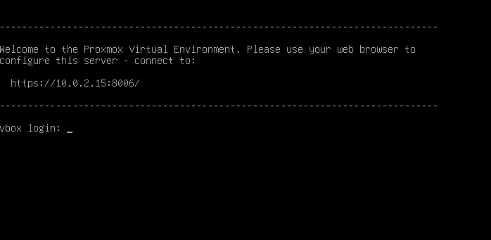

There's no need to login or do anything else with your Proxmox homelab at this stage, everything else from this point forward will be done remotely from another device on your home network. 

You can, at this point, remove peripherals from your homelab, but I personally like to wait until I have everything setup and running, just in case.

Using another device (preferably a computer, though you could probably use a mobile device too) open a browser and enter the address we noted down in the last step (which you'll notice is also displayed in the previous screenshot).

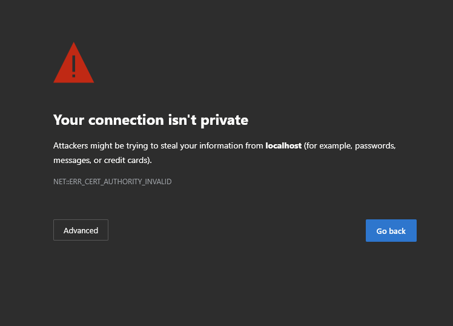

Don't be intimidated by this warning. 
*I'm using Edge to access Proxmox, so if you're using another browser, you might see a slightly different warning.*

All this warning is trying to tell us is that we're trying to access a secured webpage that doesn't have a valid certificate, just hit the advanced button on the bottom left, then you should hopefully see a slightly less obvious "continue" button

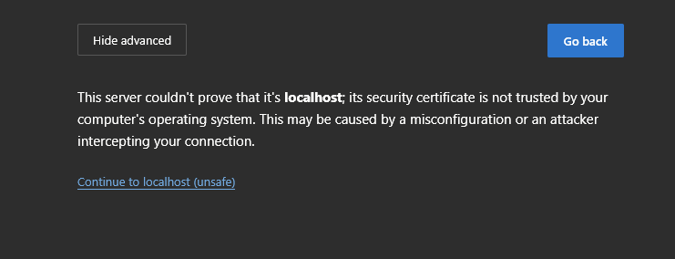

Once you've hit continue, you'll now finally be greeted by the Proxmox GUI!

But first, you need to enter a username and a password. We definitely setup a password, but we never selected a username, so what do we enter?

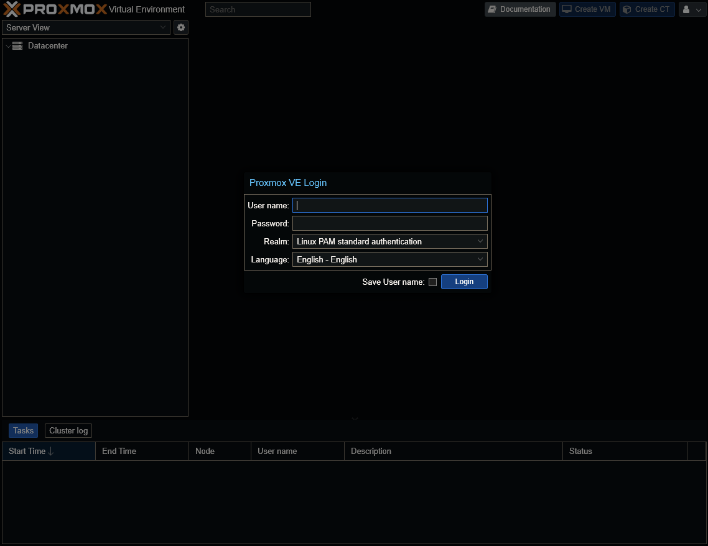

Simply enter *root* as the username, and the password you selected earlier. If you want, you can also select "Save User name". 

**Now hit login!!!**
*Little bit too excited for logging into Proxmox*

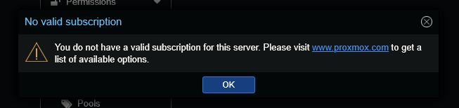

Hang on a second... I thought Proxmox is free?! Why is it **now** telling me I need a subscription?

Okay, so while Proxmox **is free** for home use, it will perpetually bug you about getting a subscription for their enterprise features, such as the enterprise update repository.

Ideally what we'd do now is go and remove those enterprise repositories and replace them with the free "no-subscription" repository, **however**, I'm going to show you an even better trick, using **helper scripts**

## Navigating the Proxmox interface

I've gotten ahead of myself. Let's take a step back and have a quick look at the Proxmox interface before we proceed.

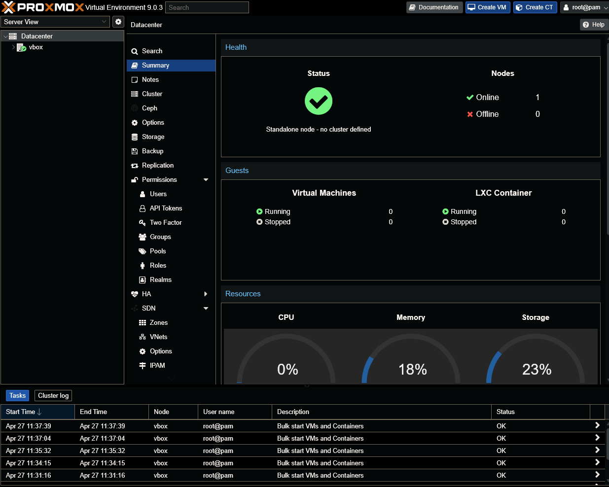

By default, "Datacenter" is selected. Think of *datacenter* as the absolute top level of Proxmox. If you had multiple Proxmox instances, or **nodes**, you'd be able to access them all from here. From *datacenter* you can manage storage, users, permissions, backups, etc. 

We're not really going to delve into this settings just yet, but I'd recommend just clicking into some of the settings, like **Storage**, **Backup**, and **Users**, just to begin to familiarise yourself with them.

Next we're going to select our **node**, which is the instance of Proxmox we just installed, in my case this is called "vbox".

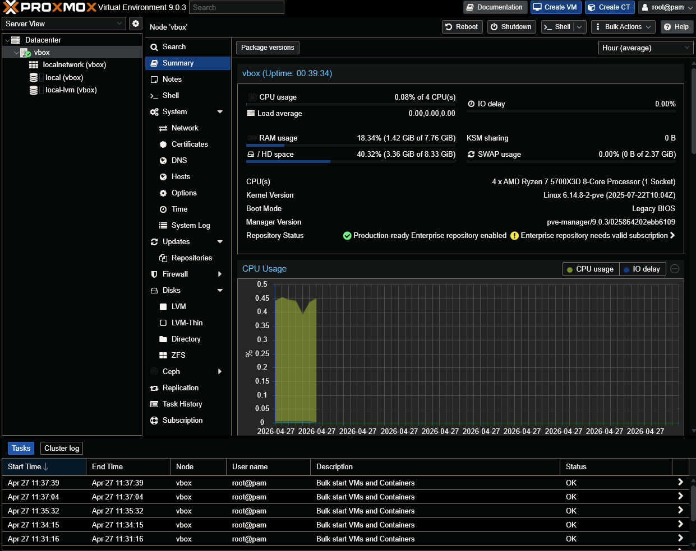

You'll notice we now have quite a few very different settings available to use compared to the *datacenter* view.

By default we'll be on the summary view. Here we'll see how much our system resources are being utilised. Scrolling down in this view you'll see many helpful charts, such as **CPU Usage**, **Memory usage**, **Network Traffic**, and many more charts that'll make monitoring your homelab a breeze. 

With your node sellected, I want you to now select the **Shell** option.

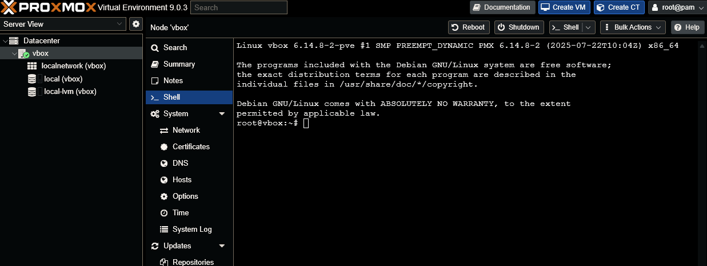

We'll be using this command line a lot throughout this guide, so I want you to start getting comfortable with it early on. It might look and sound intimidating, but I promise you, it won't take you long to get comfortable with using it.

Let's try doing some simple commands!

Type in:

    pveversion

Then hit **enter** on your keyboard. It should show both the version of Proxmox VE you're using, along with the kernel version.

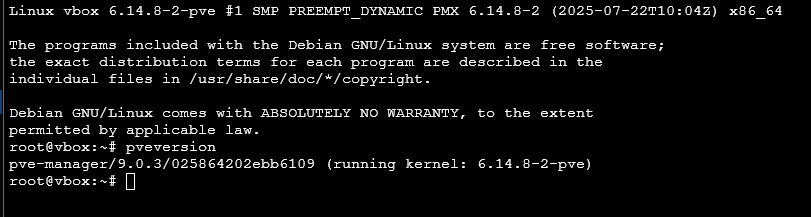

Okay, let's try something else. Type in the following:

    ping google.com

This is a good way to test that our homelab is connected to the network. If you get an error with this command, it could mean there's a problem with your network setup.

Assuming the command worked correctly, you should see something like:

> 64 bytes from  example blah blah blah time=18ms

This will repeat every second, and it doesn't seem to stop! 

Okay, we know our network connection works fine, that's awesome. But, how do we **stop** this ping command?

Simply press **CTRL + C** on your keyboard, the very same keyboard shortcut you'd use to copy something. This will terminate the command and allow us to type in something else.

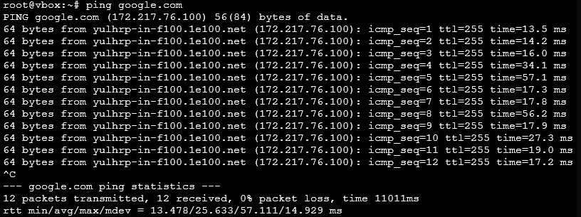

I think that's enough shell, *for now*.

We'll be using the shell quite a lot, so if you're really not comfortable using the shell, I would recommend following [**The Linux command line for beginners**](https://ubuntu.com/tutorials/command-line-for-beginners#1-overview) guide by Ubuntu.

There's a few more aspects of the interface I want to show you before we proceed further.

In the top right of the interface you'll see buttons for creating both a [VM and a CT (LXC)](../infrastructure/faq.md#vms-vs-lxc).

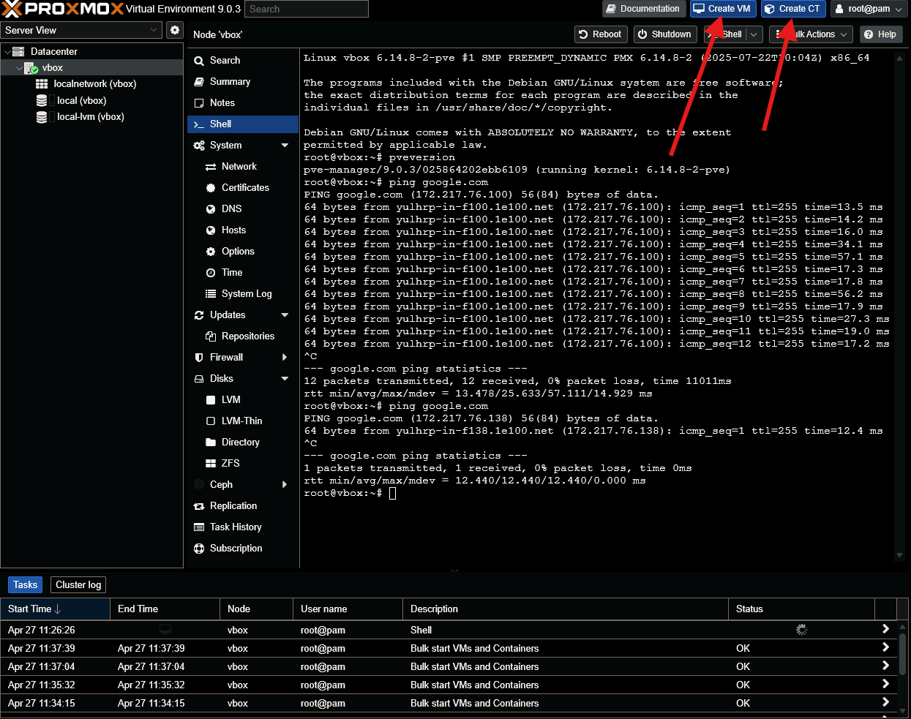

At the bottom of the page there is a **Tasks** log, with an **>** button on the right side of each entry which you can click for further details

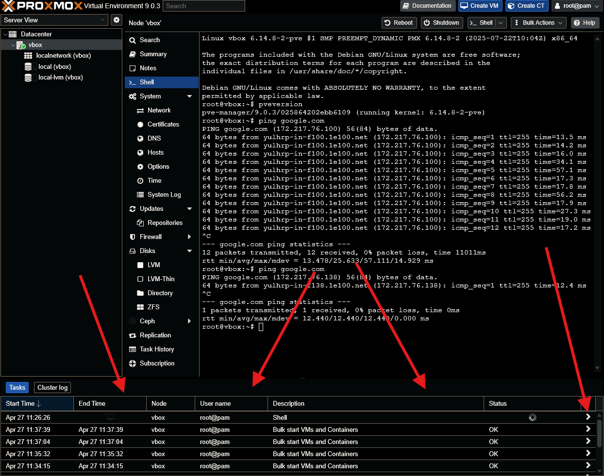

For now, I think that's enough. We'll naturally learn about the various different pages, options, settings, etc. Of Proxmox as we progress through this guide. 

## Post installation tweaks

*If you haven't yet, I recommend you read my FAQ page on **helper scripts***

We're going to use our first helper script, the [**PVE Post Install**](https://community-scripts.org/scripts?q=post%20install) script. Let's look at the description and break it down.

> This script provides options for managing Proxmox VE repositories, including disabling the Enterprise Repo, adding or correcting PVE sources, enabling the No-Subscription Repo, adding the test Repo, disabling the subscription nag, updating Proxmox VE, and rebooting the system.

As you can see, everything that we need to finalize our Proxmox installation is automated via this script. It'll not only disable the enterprise repo that we cannot utilize, but also add the ones that we can actually use, meaning we can update our Proxmox server without issue! Speaking of updating, it'll also very kindly update our Proxmox instance for us. And the icing on the cake, we won't have to deal with that pesky subscription warning anymore!

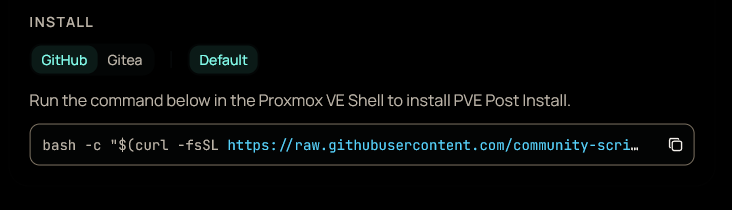

Copy the command from bottom of the [**PVE Post Install**](https://community-scripts.org/scripts?q=post%20install) page.

Go back to our Proxmox web UI, select our node, and then select **Shell**. You may notice that we can't use **CTRL + V** to paste into the shell, you can just right click into the body of the shell and selected "paste", however, I like to use the keyboard shortcut **Shift + INS**, with the **INS** key being above the arrows if you're using a full sized keyboard.

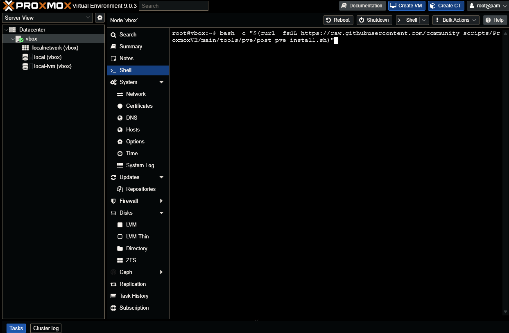

Paste in the command and hit enter.

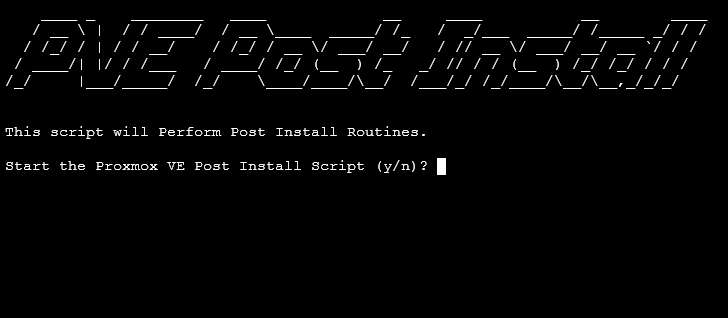

Once you've hit enter, you should see something like the previous screenshot. All you need to do hear is type the letter **y** and then press enter again.

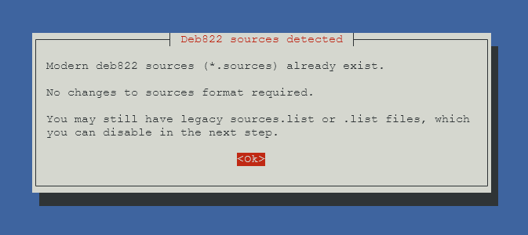

Now the previously black shell window will turn blue, and a greyish window has appeared in the middle. I got this little warning saying:

> Modern deb822 sources already exist

I don't need to worry about this. I simply press enter to continue.

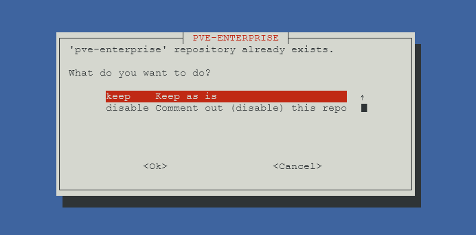

The default option here is **Keep as is**, we don't want to keep anything as it is. You're going to want to use the down arrow on your keyboard to select the option that will actually do what we want it to do. In this case that's the **Comment out (disable) this repo** option. Then do the same for the next option.

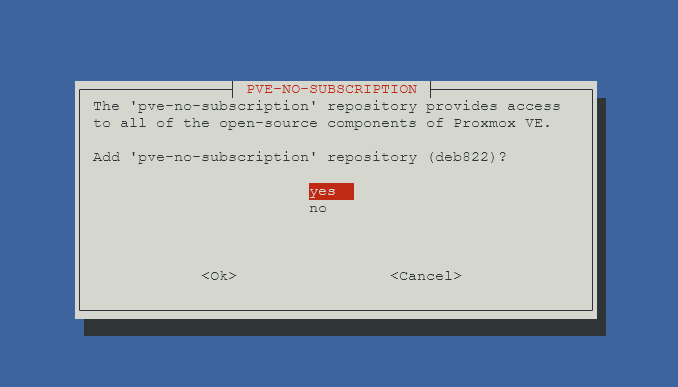

We absolutely do want the *pve-no-subscription* repository, so press enter on the default **yes** option.

Also select **yes** on the next prompt on disabling the *pvetest* repository.

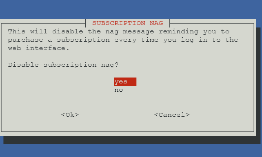

Ah yes, we also remove that subscription nag! Absolutely **yes** this this!

Hit enter on the to select **Ok** on the "Support Subscriptions" prompt

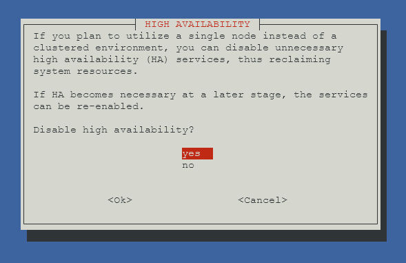

Since we're only using a single node (our one PC running Proxmox), we can select **yes** to disabling **high availability**.

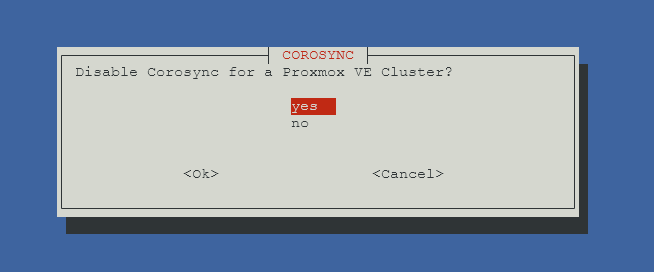

I don't think we really need to disable [**Corosync**](https://dev.to/chikarainohara/the-heart-of-a-proxmox-cluster-understanding-corosync-for-a-stable-homelab-1h2k), so hit the down arrow to select no, and press enter.

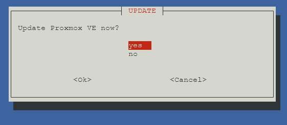

Finally, we're asked as to whether or not we want to update Proxmox VE? Let's select **yes** for now, though I recommend reading my **how to update Proxmox** to get an idea for how to do this manually.

This will take a little while, so maybe go make a cup of coffee while you wait.
